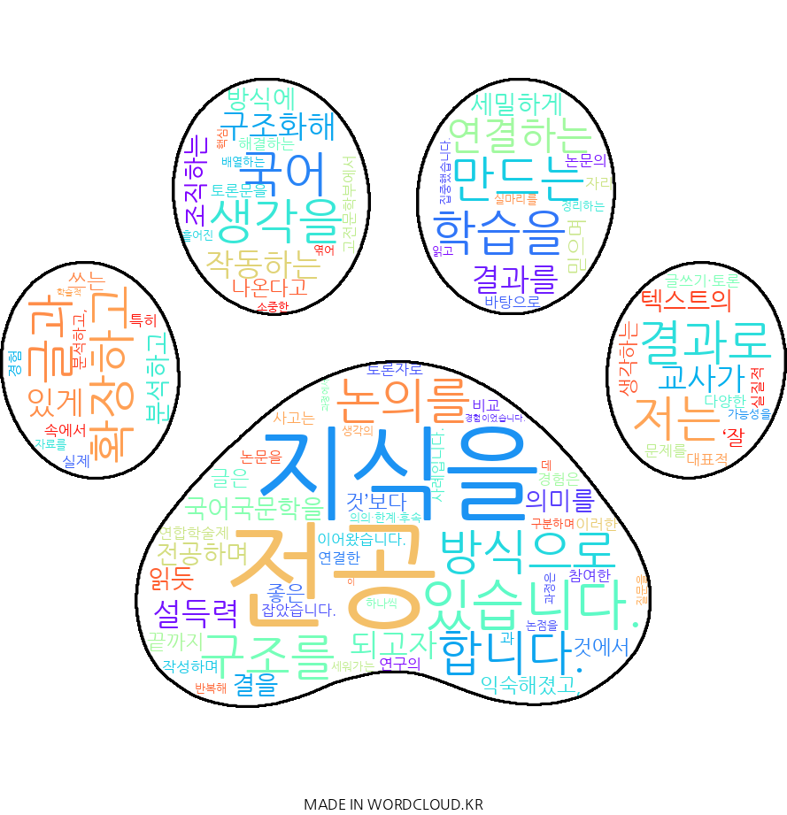

# Jo Wooryeong Profile

조우령의 자기 소개 페이지입니다.

## 저는 **생각을 구조화해 설득력 있게 작동하는 글과 결과를 만드는 국어 교사**가 되고자 합니다.

국어국문학을 전공하며 텍스트의 결을 세밀하게 읽듯 의미를 분석하고 조직하는 방식에 익숙해졌고, 좋은 글은 ‘잘 쓰는 것’보다 **끝까지 생각하는 것**에서 나온다고 믿으며 학습을 이어왔습니다. 이러한 사고는 다양한 글쓰기·토론 경험 속에서 실제 문제를 해결하는 방식으로 자리 잡았습니다.

특히 고전문학부에서 연합학술제 토론자로 참여한 경험은 전공 지식을 실질적 결과로 연결한 대표적 사례입니다. <춘향전>과 <옥단춘전> 비교 논문을 바탕으로 토론문을 작성하며 논문의 구조를 분석하고, 연구의 의의·한계·후속 가능성을 정리하는 데 집중했습니다. 자료를 반복해 읽고 핵심 논점을 구분하며 질문을 배열하는 과정은 **흩어진 생각의 실마리를 하나씩 엮어 구조를 세워가는 소중한 경험**이었습니다. 이 과정에서 학술적 논의를 정리하고 새로운 관점을 제안하는 글쓰기가 제 역량임을 확인했습니다.

이후 저는 전공 학습을 타인과 공유하는 방식으로 확장하고 있습니다. 고전문학부 총무로서 학술 활동을 운영하며 구성원 간 논의를 조율하고, 칼럼·토론 프로그램에 꾸준히 참여해 전공 지식과 사회적 이슈를 연결하는 글쓰기를 이어가고 있습니다. 앞으로는 교직 이수를 통해 전공 지식을 학습자가 이해할 수 있는 언어로 재구성하며, **학문과 사람을 연결하는 국어 교사**로 성장하고자 합니다. 이를 위해 학술부 세미나 운영과 독서 토론 기획을 맡아 지식을 나누는 방식을 실천적으로 확장하고 있습니다. **생각을 결과로 만드는 글과 교육으로 사회와 소통하는 것**이 저의 목표입니다.

### 한 발 한 발 나아가고자 합니다.

