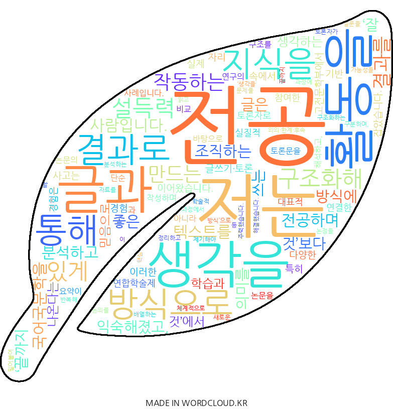

# Jo Wooryeong Profile

조우령의 자기 소개 페이지입니다.

## 제가 하고자 하는 것은 **생각을 구조화해 설득력 있게 작동하는 글과 결과를 만드는 국어교사**입니다.

국어국문학을 전공하며 텍스트를 분석하고 의미를 조직하는 방식에 익숙해졌고, 좋은 글은 '잘 쓰는 것'보다 **끝까지 생각하는 것**에서 나온다는 믿음으로 학습과 활동을 이어왔습니다. 이러한 전공 기반 사고는 다양한 글쓰기·토론 경험 속에서 실제 문제를 해결하는 방식으로 자리 잡았습니다.

특히 고전문학부에서 연합학술제 토론자로 참여한 경험은 전공 지식을 실질적 결과로 연결한 대표적 사례입니다. <춘향전>과 <옥단춘전> 비교 논문을 바탕으로 토론문을 작성하며 논문의 구조를 분석하고, 연구의 의의·한계·후속 가능성을 분석하는 과정에 주력했습니다. 자료를 반복해 읽고 핵심 논점을 구분하며, 토론자가 제기해야 할 질문을 체계적으로 배열하는 등 **생각을 끝까지 밀어붙여 구조화하는 방식**으로 문제를 해결했습니다. 이 과정에서 학술적 논의를 정리하고 새로운 관점을 제안하는 글쓰기가 제 역량임을 확인했습니다.

이후 저는 전공 학습을 타인과 공유하는 방식으로 확장하고 있습니다. 고전문학부 총무로서 학술 활동을 운영하며 구성원 간 논의를 조율하고, 칼럼·토론 프로그램에 꾸준히 참여해 전공 지식과 사회적 이슈를 연결하는 글쓰기를 이어가고 있습니다. 앞으로는 교직 이수를 통해 전공 지식을 학습자가 이해할 수 있는 언어로 재구성하며, **학문과 사람을 연결하는 국어교사**로 성장하고자 합니다. 이를 위해 글쓰기 능력뿐 아니라 소통 방식과 교육적 감수성까지 함께 확장해 나가고 있습니다. **생각을 결과로 끝내는 글과 교육으로 사회와 소통하는 것**이 저의 목표입니다.

